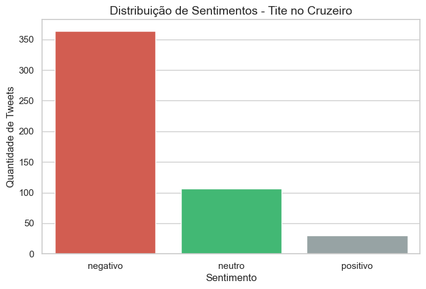
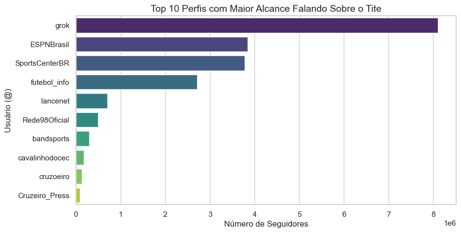

# Análise de Sentimentos: Tite no Cruzeiro 🦊

## Sobre o Projeto
O projeto consiste em extrair tweets e analisar esses dados a fim de descobrir os sentimentos e a percepção da torcida do Cruzeiro em relação ao atual treinador da equipe, Tite. A análise é feita aplicando técnicas de Processamento de Linguagem Natural (NLP) e Machine Learning para classificar a opinião pública e cruzar esses dados com métricas de engajamento.

## Metodologia do Projeto
O pipeline de dados foi desenvolvido nas seguintes etapas:

1. **Coleta de Dados (Web Scraping)**: 
   - Utilização da biblioteca `twikit` para extrair tweets reais contendo os termos `"Tite"` e `"Cruzeiro"`.
   - Remoção de retweets da busca para focar apenas em opiniões originais.
   - Foram extraídos dados como: texto, data, usuário, seguidores, likes, retweets e respostas.
   
2. **Limpeza e Pré-processamento**: 
   - Tratamento dos textos para remover ruídos e padronizar o conteúdo antes da análise do modelo.

3. **Classificação de Sentimentos (NLP)**: 
   - Aplicação do modelo **XLM-RoBERTa** (`cardiffnlp/twitter-xlm-roberta-base-sentiment`), através da biblioteca Transformers da Hugging Face.
   - O modelo avalia cada tweet e retorna o sentimento final (**Positivo, Neutro ou Negativo**), além de um score de confiança da predição.

4. **Análise Exploratória de Dados (EDA)**: 
   - Análises gráficas e estatísticas focadas em entender a relação entre o sentimento da torcida e o engajamento na rede social.

## Tecnologias e Bibliotecas Utilizadas
* **Linguagem:** Python
* **Coleta de Dados:** Twikit, Asyncio
* **Manipulação de Dados:** Pandas
* **Machine Learning / NLP:** PyTorch, Hugging Face Transformers
* **Visualização:** Matplotlib, Seaborn
* **Ambiente:** Jupyter Notebook, Python Dotenv

## Principais Resultados e Insights
A partir do notebook de análises exploratórias, investigamos os seguintes cenários:

* **Distribuição Geral de Sentimentos**: 
  - Avaliação do balanço da opinião pública (proporção de comentários negativos, neutros e positivos) para entender a aprovação geral do trabalho do treinador.
  
* **Top 10 Perfis com Maior Alcance**: 
  - Identificação de quais usuários e influenciadores falando sobre o Tite possuem a maior base de seguidores.
  
* **Engajamento vs. Sentimento**: 
  - Análise da média de engajamento total (soma de curtidas, retweets e respostas) por categoria de sentimento. Revela qual tipo de emoção gera mais repercussão e interação na rede.
  
* **Contas Grandes vs. Contas Pequenas**: 
  - Divisão dos usuários entre Contas Grandes (> 5.000 seguidores) e Contas Pequenas/Médias. 
  - Permite identificar se formadores de opinião têm uma visão diferente do torcedor comum.
   
* **Confiança do Modelo**: 
  - Verificação da distribuição do *Score* de confiança da inteligência artificial nas classificações realizadas.
  

## Estrutura de Diretórios
```text
├── data/
│   ├── processed/       # Dados limpos e resultados da análise de sentimento
│   └── raw/             # Dados brutos coletados do Twitter/X
├── src/
│   ├── scraper.py       # Script responsável pela coleta dos tweets
│   ├── prepocessor.py   # Script para limpeza dos dados
│   ├── sentiment.py     # Script que carrega o modelo BERT e classifica os tweets
│   ├── cleasing.ipynb   # Notebook de testes de limpeza
│   └── analises.ipynb   # Notebook contendo os gráficos e insights finais
├── .env                 # Variáveis de ambiente
├── cookies.json         # Autenticação para o web scraping
└── README.md            # Documentação do projeto


Este projeto está licenciado sob a MIT License.
Desenvolvido por João Otávio Gurgel de Oliveira. Projeto para fins de classificação de sentimentos em tweets sobre o Tite no Cruzeiro. 
